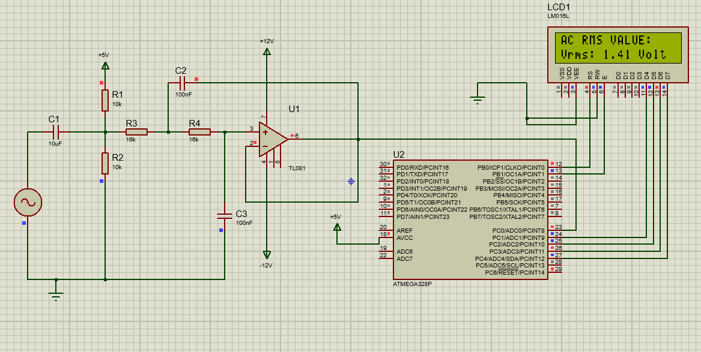
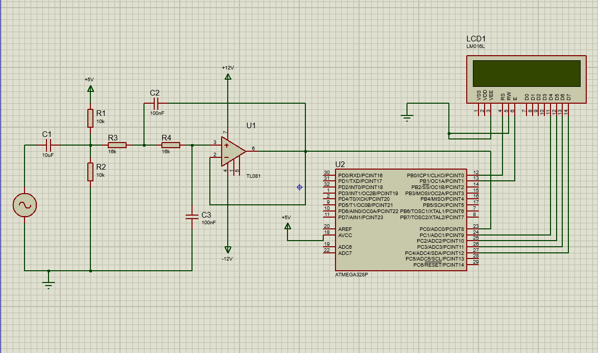

# Precision AC RMS Monitor ⚡ (Hassas AC RMS Monitörü)

[🇹🇷 Türkçe açıklama aşağıdadır](#türkçe-açıklama)

A highly accurate, bare-metal AC RMS voltage measurement system designed for ATmega328P. This project bridges analog signal processing with digital true-RMS calculation, featuring a custom Auto-Zero calibration algorithm.

## 🔌 Circuit Design / Devre Şeması

## 🚀 Key Features
* **True RMS Calculation:** Utilizes high-speed ADC sampling and a robust sum-of-squares mathematical algorithm written in pure C.
* **Auto-Zero Calibration:** Automatically detects and compensates for hardware DC offset drifts at startup, eliminating the need for hard-coded reference values.
* **Analog Front-End:** Incorporates a Sallen-Key low-pass filter and DC biasing using a TL081 Op-Amp for clean signal conditioning.
* **Linearity & Hardware Limits:** The system operates with high precision up to a maximum of **3.5V (Peak)**. Beyond this 3.5V threshold, the measurements deliberately break down and become inaccurate due to the physical 5V clipping limits of the ATmega328P's ADC.

## 🛠️ Tech Stack & Tools
* **Language:** C/C++ (Bare-metal AVR)
* **Simulation:** Proteus Professional
* **Hardware:** ATmega328P, TL081 Op-Amp, 16x2 Character LCD
* **Core Concepts:** ADC Polling, Signal Attenuation, Non-linear Hardware Limits, Offset Shifting.

## 🧠 Engineering Insights: The Auto-Zero Algorithm
Standard offset removal assumes ideal component values (e.g., exactly 2.5V = 512 ADC). In reality, resistor tolerances and power supply fluctuations cause offset shifts, exponentially increasing RMS calculation errors. To solve this, I implemented a dynamic calibration sequence that averages 1000 samples at boot to establish the *true* hardware zero-point. This strictly isolates the AC signal and completely eliminates DC leakage in the RMS math.

---

<h2 id="türkçe-açıklama">🇹🇷 Türkçe Açıklama</h2>

ATmega328P için tasarlanmış, yüksek doğruluklu, bare-metal AC RMS voltaj ölçüm sistemi. Bu proje, analog sinyal işleme ile dijital true-RMS hesaplamasını birleştirir ve özel bir "Auto-Zero" (Otomatik Sıfırlama) kalibrasyon algoritması içerir.

## 🚀 Temel Özellikler
* **Gerçek (True) RMS Hesaplaması:** Yüksek hızlı ADC örnekleme ve saf C ile yazılmış sağlam bir kareler toplamı (sum-of-squares) matematiksel algoritması kullanır.
* **Otomatik Sıfırlama (Auto-Zero) Kalibrasyonu:** Başlangıçta donanımsal DC ofset kaymalarını otomatik olarak algılar ve telafi eder. Böylece koda sabit referans değerleri (hard-coded) girme zorunluluğunu ortadan kaldırır.
* **Analog Giriş Katı (Front-End):** Temiz bir sinyal koşullandırma için TL081 Op-Amp kullanan Sallen-Key alçak geçiren filtre ve DC öngerilim (biasing) devresi içerir.
* **Doğrusallık Aralığı ve Donanım Limitleri:** Sistem, maksimum **3.5V (Tepe/Peak)** genliğine kadar kusursuz ve yüksek hassasiyetli çalışmaktadır. 3.5V sınırından sonra, ATmega328P'nin ADC'si fiziksel doyum noktasına (clipping) ulaştığı için sinyaller kırpılır ve sistem kasıtlı olarak hatalı/bozuk sonuçlar verir.

## 🛠️ Kullanılan Teknolojiler ve Araçlar
* **Dil:** C/C++ (Bare-metal AVR)
* **Simülasyon:** Proteus Professional
* **Donanım:** ATmega328P, TL081 Op-Amp, 16x2 Karakter LCD
* **Temel Kavramlar:** ADC Polling, Sinyal Sönümleme (Attenuation), Doğrusal Olmayan Donanım Limitleri, Ofset Kaydırma.

## 🧠 Mühendislik Analizi: Auto-Zero Algoritması
Standart ofset kaldırma işlemleri, ideal komponent değerlerini varsayar (örneğin, tam olarak 2.5V = 512 ADC). Gerçekte ise direnç toleransları ve güç kaynağı dalgalanmaları ofset kaymalarına neden olarak RMS hesaplama hatalarını üstel olarak artırır. Bunu çözmek için, *gerçek* donanım sıfır noktasını belirlemek amacıyla sistem açılışında 1000 örneğin ortalamasını alan dinamik bir kalibrasyon dizisi uyguladım. Bu algoritma, AC sinyalini kesin bir şekilde izole eder ve RMS matematiğindeki DC sızıntısını tamamen ortadan kaldırır.

---
*Karmaşık sinyal (mixed-signal) sistemlerinin ve mikrodenetleyici limitlerinin pratik bir incelemesi olarak geliştirilmiştir.*
